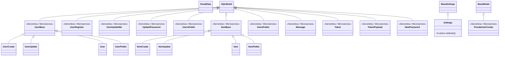

```mermaid
classDiagram
    %% Custom Cloud Styles
    classDef cloudClass fill:#e3f2fd,stroke:#1565c0,stroke-width:2px,color:#000;
    classDef standardClass fill:#ffffff,stroke:#333,stroke-width:1px;
    class UserBase {
        <<Serverless / Microservice>>
    }
    cssClass "UserBase" cloudClass
    class UserCreate {
    }
    cssClass "UserCreate" standardClass
    class UserRegister {
        <<Serverless / Microservice>>
    }
    cssClass "UserRegister" cloudClass
    class UserUpdate {
    }
    cssClass "UserUpdate" standardClass
    class UserUpdateMe {
        <<Serverless / Microservice>>
    }
    cssClass "UserUpdateMe" cloudClass
    class UpdatePassword {
        <<Serverless / Microservice>>
    }
    cssClass "UpdatePassword" cloudClass
    class User {
    }
    cssClass "User" standardClass
    class UserPublic {
    }
    cssClass "UserPublic" standardClass
    class UsersPublic {
        <<Serverless / Microservice>>
    }
    cssClass "UsersPublic" cloudClass
    class ItemBase {
        <<Serverless / Microservice>>
    }
    cssClass "ItemBase" cloudClass
    class ItemCreate {
    }
    cssClass "ItemCreate" standardClass
    class ItemUpdate {
    }
    cssClass "ItemUpdate" standardClass
    class Item {
    }
    cssClass "Item" standardClass
    class ItemPublic {
    }
    cssClass "ItemPublic" standardClass
    class ItemsPublic {
        <<Serverless / Microservice>>
    }
    cssClass "ItemsPublic" cloudClass
    class Message {
        <<Serverless / Microservice>>
    }
    cssClass "Message" cloudClass
    class Token {
        <<Serverless / Microservice>>
    }
    cssClass "Token" cloudClass
    class TokenPayload {
        <<Serverless / Microservice>>
    }
    cssClass "TokenPayload" cloudClass
    class NewPassword {
        <<Serverless / Microservice>>
    }
    cssClass "NewPassword" cloudClass
    class EmailData {
    }
    cssClass "EmailData" standardClass
    class Settings {
        +6 active methods()
    }
    cssClass "Settings" standardClass
    class PrivateUserCreate {
        <<Serverless / Microservice>>
    }
    cssClass "PrivateUserCreate" cloudClass
    SQLModel <|-- UserBase
    UserBase <|-- UserCreate
    SQLModel <|-- UserRegister
    UserBase <|-- UserUpdate
    SQLModel <|-- UserUpdateMe
    SQLModel <|-- UpdatePassword
    UserBase <|-- User
    UserBase <|-- UserPublic
    SQLModel <|-- UsersPublic
    SQLModel <|-- ItemBase
    ItemBase <|-- ItemCreate
    ItemBase <|-- ItemUpdate
    ItemBase <|-- Item
    ItemBase <|-- ItemPublic
    SQLModel <|-- ItemsPublic
    SQLModel <|-- Message
    SQLModel <|-- Token
    SQLModel <|-- TokenPayload
    SQLModel <|-- NewPassword
    BaseSettings <|-- Settings
    BaseModel <|-- PrivateUserCreate
```